# 🏗️ Scaffolding - The Ultimate Project Foundation Toolkit

A meta-framework for creating robust project foundations across any domain - coding, writing, research, or business ventures. This repository contains specialized agents, slash commands, and comprehensive guides that generate the foundational documents and structures needed for successful projects.

## 🎯 Philosophy

**Every great project starts with a great foundation.** This scaffolding system ensures:
- ✅ Consistent project structure across teams
- ✅ Parallel execution from day one
- ✅ Built-in quality enforcement
- ✅ AI-human alignment through clear contracts
- ✅ Proven patterns and practices baked in

## 🗺️ System Overview

```mermaid
flowchart TD
    Start["🚀 New Project"] --> ProjectType{"Project Type?"}
    
    ProjectType -->|Code| CodeArch["code-project-architect"]
    ProjectType -->|Writing| WriteArch["writing-project-architect"]
    ProjectType -->|Research| ResearchArch["research-project-architect"]
    
    CodeArch --> Foundation["📄 Foundation Documents"]
    WriteArch --> Foundation
    ResearchArch --> Foundation
    
    Foundation --> PRD["PRD.md"]
    Foundation --> ARCH["ARCHITECTURE.md"]
    Foundation --> RULES["RULES.md"]
    Foundation --> TASKS["TASKS.md"]
    
    TASKS --> Parallel["🔀 Parallel Streams"]
    
    Parallel --> Stream1["Stream A: Backend"]
    Parallel --> Stream2["Stream B: Frontend"]
    Parallel --> Stream3["Stream C: Data"]
    
    Stream1 --> Integration["🔗 Integration"]
    Stream2 --> Integration
    Stream3 --> Integration
    
    Integration --> Quality["✅ Quality Check"]
    Quality --> Deploy["🚢 Deploy"]
```



## 📁 Where Documents Land

**Important:** Scaffolded documents are created in `projects/[project-name]/` within the scaffolding repository.

```bash
# From the scaffolding repo:
cd ~/Projekter/scaffolding
/scaffold-all "my-app" "web"
# Creates: projects/my-app/docs/, projects/my-app/.claude/, etc.

# Your scaffolding repo structure:
scaffolding/
├── guides/          # Template library
├── .claude/         # Agents & commands
├── projects/        # YOUR PROJECTS HERE
│   ├── my-app/      # Created by scaffolding
│   ├── another-app/ # Another project
│   └── ...          # All your scaffolded projects
└── README.md
```

This keeps your scaffolding templates separate from your actual projects, and organizes all scaffolded projects in one place. 

**Each project also gets:**
- 🤖 **Project-specific agents** (e.g., frontend-developer for web, editor for writing)
- ⚡ **Custom slash commands** (e.g., /create-component, /add-chapter)
- 🎨 **Output style configuration** tailored to the project type

See [USAGE.md](guides/USAGE.md) for detailed workflows.

## 📚 Comprehensive Guide Library

### Core Documentation Guides

| Guide | Purpose | When to Use |
|-------|---------|-------------|
| [PRD.md](guides/PRD.md) | Product Requirements Document template | Starting any project |
| [ARCHITECTURE.md](guides/ARCHITECTURE.md) | System design and technical approach | After PRD completion |
| [RULES.md](guides/RULES.md) | Non-negotiable constraints | Setting project standards |
| [TASKS.md](guides/TASKS.md) | Work breakdown with parallelization | Planning execution |
| [BEST-PRACTICES.md](guides/BEST-PRACTICES.md) | Code craftsmanship standards | During development |
| [PATTERNS.md](guides/PATTERNS.md) | Approved design patterns | Solving common problems |
| [ANTI-PATTERNS.md](guides/ANTI-PATTERNS.md) | What to avoid and why | Code reviews & refactoring |
| [CLAUDE.md](guides/CLAUDE.md) | AI agent work contract | AI-assisted development |
| [GIT-STRATEGY.md](guides/GIT-STRATEGY.md) | Version control workflow | Team collaboration |
| [EVALS_AND_TESTING.md](guides/EVALS_AND_TESTING.md) | Testing and evaluation strategy | Quality assurance |

### Supporting Documentation

| Guide | Purpose |
|-------|---------|
| [SLASH-COMMANDS.md](guides/SLASH-COMMANDS.md) | Custom command creation |
| [SUBAGENTS.md](guides/SUBAGENTS.md) | Specialized agent development |
| [HOOKS.md](guides/HOOKS.md) | Automation workflows |
| [OUTPUT-STYLE.md](guides/OUTPUT-STYLE.md) | Output formatting standards |

## 🤖 Specialized Agents


### Agent Descriptions

| Agent | Specialty | Trigger |
|-------|-----------|---------|
| `code-project-architect` | Software project foundations | Starting coding projects |
| `writing-project-architect` | Book/documentation structure | Starting writing projects |
| `research-project-architect` | Research methodology setup | Starting research projects |
| `task-decomposer` | Breaking PRD into parallel tasks | After PRD completion |
| `parallel-optimizer` | Maximizing concurrent execution | Sprint planning |
| `code-quality-guardian` | Enforcing best practices | Code changes/reviews |
| `antipattern-detector` | Finding problematic code | Refactoring sessions |
| `document-validator` | Ensuring doc consistency | Document updates |

## ⚡ Slash Commands


### Command Reference

| Command | Function | Arguments |
|---------|----------|-----------|
| `/scaffold-all` | Generate complete project foundation | `[project-name] [type]` |
| `/scaffold-prd` | Create PRD from requirements | `[project-type]` |
| `/scaffold-architecture` | Generate architecture docs | `[tech-stack]` |
| `/scaffold-tasks` | Break PRD into parallel tasks | `[prd-section]` |
| `/scaffold-practices` | Create stack-specific standards | `[language] [framework]` |
| `/analyze-parallelism` | Find parallel execution opportunities | - |
| `/detect-antipatterns` | Scan for problematic code | - |
| `/validate-docs` | Check document consistency | - |

## 🚀 Quick Start Workflows

### Workflow 1: Start New Coding Project


**Steps:**
1. Run `/scaffold-all "ProjectName" "web"`
2. Answer project-specific questions
3. Review generated documents
4. Run `/analyze-parallelism` for team allocation
5. Start development with parallel streams

### Workflow 2: Refactor Existing Codebase


**Steps:**
1. Run `/detect-antipatterns` to find issues
2. Generate practices with `/scaffold-practices`
3. Use `code-quality-guardian` for enforcement
4. Validate with `/validate-docs`

### Workflow 3: Writing Project Setup


## 📊 Parallelization Power

The system transforms sequential work into parallel streams:


**Result:** 17 days → 9 days (47% reduction!)

## 🏛️ Document Architecture

```mermaid
flowchart TD
    subgraph "Foundation Layer"
        PRD["📋 PRD.md<br/>What to build"]
        ARCH["🏗️ ARCHITECTURE.md<br/>How to build"]
        RULES["⚖️ RULES.md<br/>Constraints"]
    end
    
    subgraph "Execution Layer"
        TASKS["📝 TASKS.md<br/>Work breakdown"]
        GIT["🌿 GIT-STRATEGY.md<br/>Version control"]
        CLAUDE["🤖 CLAUDE.md<br/>AI contract"]
    end
    
    subgraph "Quality Layer"
        BEST["✨ BEST-PRACTICES.md<br/>Standards"]
        PATTERNS["🎯 PATTERNS.md<br/>Solutions"]
        ANTI["🚫 ANTI-PATTERNS.md<br/>Avoid"]
        TEST["🧪 EVALS_AND_TESTING.md<br/>Validation"]
    end
    
    PRD --> TASKS
    ARCH --> TASKS
    RULES --> BEST
    
    TASKS --> GIT
    BEST --> PATTERNS
    PATTERNS --> ANTI
    
    CLAUDE --> PRD
    CLAUDE --> ARCH
    CLAUDE --> RULES
```



## 📈 Success Metrics

Track your project health:

- **Parallelization Rate:** % of tasks executable in parallel (target: >60%)
- **Document Consistency:** Cross-reference validity (target: 100%)
- **Anti-pattern Count:** Detected issues (target: 0 critical)
- **Task Completion Rate:** On-time delivery (target: >90%)
- **Quality Score:** Best practice adherence (target: >95%)

## 🛠️ Installation & Setup

```bash
# Clone the repository
git clone https://github.com/yourusername/scaffolding.git

# Navigate to project
cd scaffolding

# Copy to Claude Code directories
cp -r .claude/agents ~/.claude/agents/
cp -r .claude/commands ~/.claude/commands/

# Or for project-specific use
cp -r .claude /your-project/.claude
```

## 🎯 Best Practices for Using This System

### Do's ✅
- Start with `/scaffold-all` for new projects
- Use `task-decomposer` immediately after PRD
- Run `document-validator` after major changes
- Employ `parallel-optimizer` for sprint planning
- Apply `antipattern-detector` before releases

### Don'ts ❌
- Skip the PRD phase
- Ignore parallelization opportunities
- Allow anti-patterns to accumulate
- Create documents manually when commands exist
- Work sequentially when parallel is possible

## 🔄 Continuous Improvement

```mermaid
flowchart LR
    Learn["📚 Learn"] --> Build["🔨 Build"]
    Build --> Measure["📊 Measure"]
    Measure --> Improve["✨ Improve"]
    Improve --> Learn
    
    Build --> Patterns["Add to PATTERNS.md"]
    Measure --> Metrics["Update success metrics"]
    Improve --> Refactor["Refactor anti-patterns"]
    Learn --> Guides["Enhance guides"]
```



## 🤝 Contributing

To enhance this scaffolding system:

1. **Add New Patterns:** Update `PATTERNS.md` with proven solutions
2. **Document Anti-patterns:** Add discoveries to `ANTI-PATTERNS.md`
3. **Create Specialized Agents:** For domain-specific needs
4. **Enhance Commands:** Add new scaffolding capabilities
5. **Share Templates:** Contribute project-type templates

## 📖 Philosophy Deep Dive

### Why Parallel Execution Matters

Traditional sequential development:
- Task A (2d) → Task B (3d) → Task C (2d) = **7 days**

Parallel execution:
- [Task A (2d) || Task B (3d) || Task C (2d)] = **3 days**

**Result:** 57% time reduction with same resources!

### The Power of Scaffolding

Good scaffolding provides:
1. **Consistency** - Same structure, every project
2. **Speed** - No blank page problem
3. **Quality** - Best practices built-in
4. **Alignment** - Everyone knows the plan
5. **Adaptability** - Easy to customize

## 🎬 Conclusion

This scaffolding system transforms project initialization from an art into a science. By combining:
- 📚 Comprehensive guides
- 🤖 Specialized agents
- ⚡ Powerful commands
- 🔀 Parallel execution
- ✅ Quality enforcement

You get consistent, high-quality project foundations that enable teams to work in parallel from day one.

**Remember:** *Every great building starts with great scaffolding. This is yours.*

---

## Quick Command Reference

```bash
# Start a new project (creates projects/my-app/)
/scaffold-all "my-app" "web"

# Create individual documents for a project
/scaffold-prd "my-app" "saas"
/scaffold-architecture "my-app" "node typescript"
/scaffold-tasks "my-app"
/scaffold-practices "my-app" "typescript" "react"

# Analysis commands (run on existing projects)
/analyze-parallelism    # Analyzes projects/[name]/docs/TASKS.md
/detect-antipatterns    # Scans projects/[name]/ for issues
/validate-docs          # Validates projects/[name]/docs/
```

---

*Built with the principles of parallel execution, quality enforcement, and comprehensive documentation. Your projects deserve a solid foundation.*