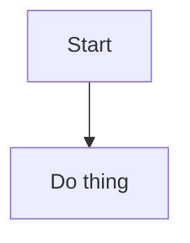
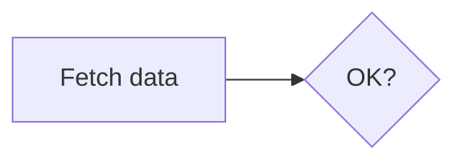
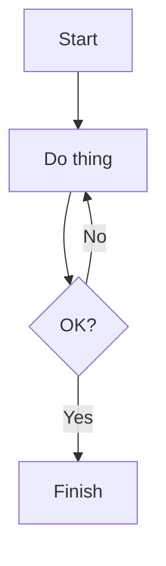
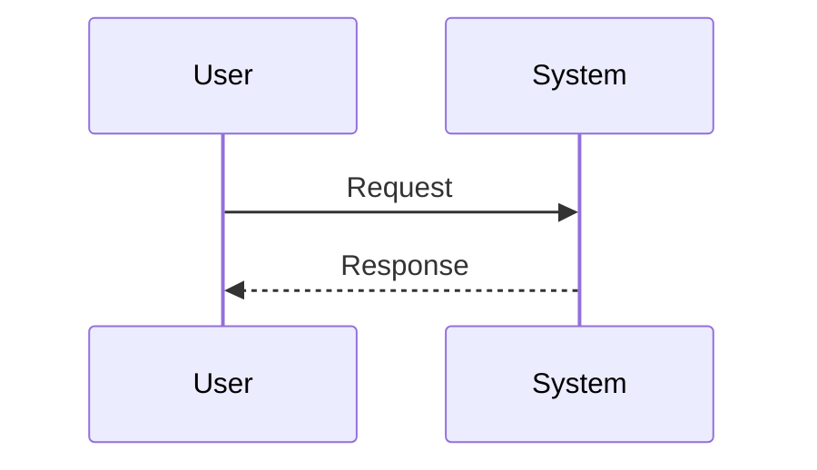
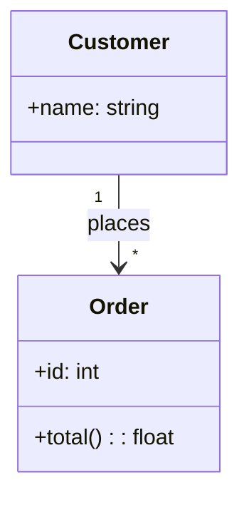
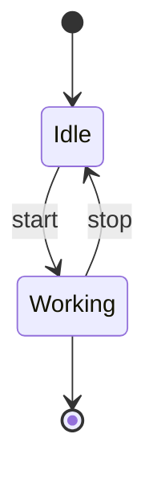
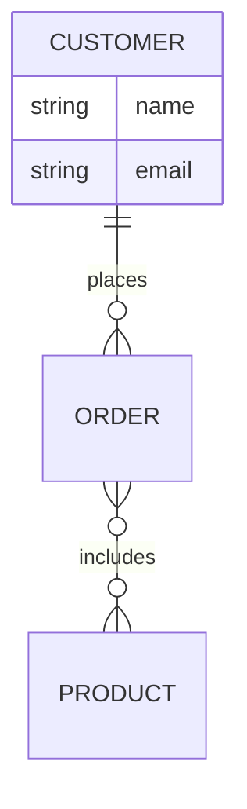
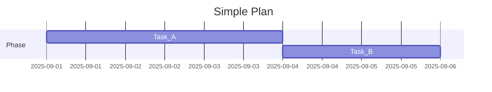
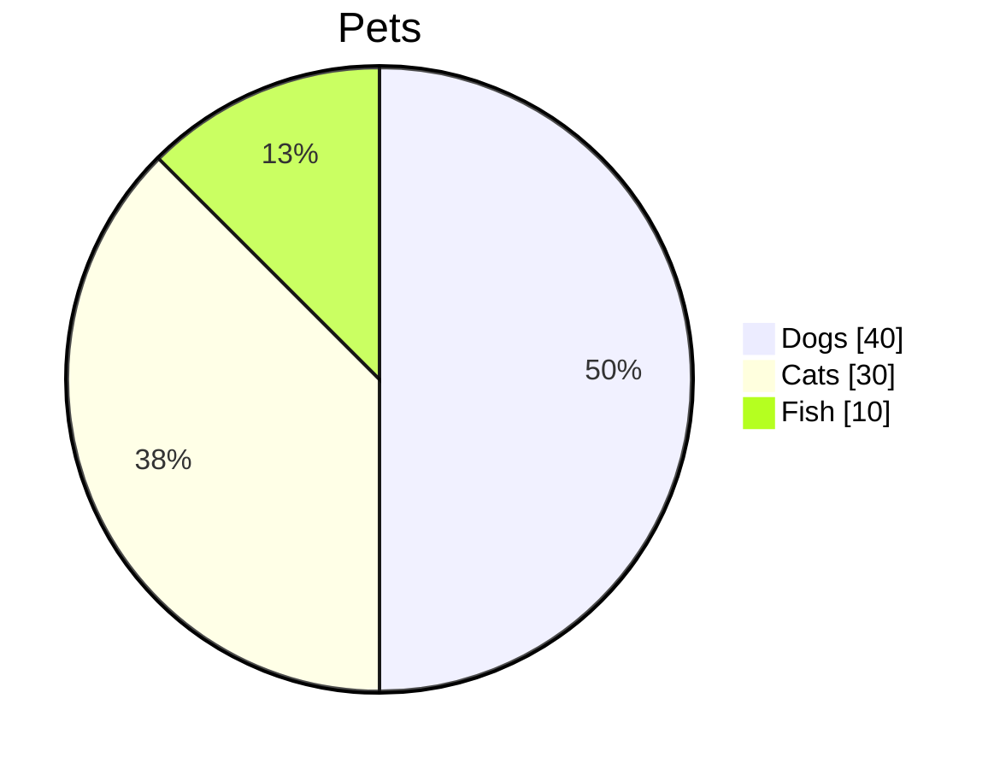
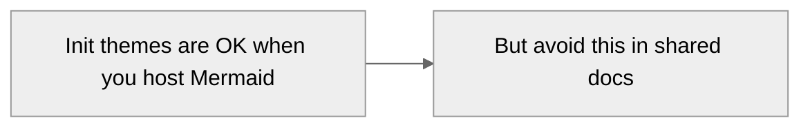

# The fool-proof way to make Mermaid charts that actually render in Markdown

You want reliability, not wizardry. Here’s a tight, no-nonsense playbook that keeps Mermaid diagrams simple and portable so they render on GitHub, docs sites, and most Markdown apps without drama.

## The golden rules (do these every time)

1. **Use a fenced code block and label it `mermaid`.** Exactly like this—no indentation, blank line before and after:

````

````

This is the one requirement every Markdown host agrees on. ([GitHub Docs][1])

2. **Start with a supported diagram type on line 1.** Examples: `flowchart`, `sequenceDiagram`, `classDiagram`, `stateDiagram-v2`, `erDiagram`, `gantt`, `pie`. If the first word is wrong, nothing renders. ([mermaid.js.org][2])

3. **Keep node IDs simple; put human text in brackets.** Use short IDs with only letters/numbers/underscores (for safety), and put the visible label in brackets to avoid parser quirks:



This avoids issues from slashes, spaces, or reserved words in IDs. (Yes, special characters can break parsing.) ([GitHub][3], [freecodecamp.org][4])

4. **Avoid advanced features unless you control the renderer.** Many hosts lock down Mermaid’s “security level” and sanitize things like click handlers and some init tweaks. Don’t rely on `%%{init: ...}%%` or `securityLevel` unless you’re running Mermaid yourself. ([mermaid.js.org][5])

5. **Stick to the “core six” for maximum compatibility.** Flowchart, Sequence, Class, State (v2), ER, Gantt, plus Pie. Newer/experimental types (mindmap, timeline, some charts) may not be enabled everywhere. ([mermaid.js.org][6])

6. **Use straight ASCII quotes and dashes.** Smart quotes from word processors will trip the parser. (This is a common cause of “Parse error on line …”.) ([mermaid.js.org][2])

7. **When in doubt, validate before you paste.** Drop your snippet into the Mermaid Live Editor; if it renders there, you likely used valid syntax. ([mermaid.live][7], [GitHub][8])

## Copy-paste templates that “just work”

These are deliberately minimal and avoid edge-case syntax. Paste into a ` ```mermaid ` block.

### 1) Flowchart



Reference syntax: nodes, arrows, labels, subgraphs (skip subgraphs unless needed). ([docs.mermaidchart.com][9])

### 2) Sequence diagram



Keep lifelines simple; use `as` for names with spaces. ([docs.mermaidchart.com][10])

### 3) Class diagram



Good for basic relationships and members; avoid deep generics if you need maximum portability. ([mermaid.js.org][2])

### 4) State diagram (v2)



Use the `-v2` variant; it’s the actively maintained one. ([mermaid.js.org][2])

### 5) ER (Entity–Relationship)



ER syntax exists and works in many hosts, but it’s been marked experimental in the docs; keep it simple. ([mermaid.js.org][6])

### 6) Gantt



Include `dateFormat` and use the same input format throughout. Relative starts like `after a1` are safe and readable. ([docs.mermaidchart.com][11])

### 7) Pie



`showData` prints the numbers and improves portability across themes. ([mermaid.js.org][2])

## Pitfalls that cause most “it won’t render” failures

* **Wrong fence or indentation.** Must be \`\`\` then `mermaid` on the same line, no leading spaces; add a blank line before/after in Markdown. ([GitHub Docs][12])
* **Typos in the diagram type.** `flowchart` not `flowChart`; `stateDiagram-v2` not `stateDiagram`. Unknown types fail silently on some hosts. ([mermaid.js.org][2])
* **Weird IDs or reserved words.** Keep IDs plain; avoid slashes, dots, spaces, and words like `end` as raw node IDs—use bracket labels instead. ([GitHub][3], [docs.mermaidchart.com][10])
* **Smart quotes and fancy punctuation** pasted from other editors. Replace with normal ASCII quotes. ([mermaid.js.org][2])
* **Platform security restrictions.** Click handlers, raw HTML, and certain `init` settings are often blocked; diagrams render, but extras won’t. ([mermaid.js.org][5])
* **Gantt without `dateFormat`, or mixed date formats.** The parser expects consistency. ([docs.mermaidchart.com][11])

## If you host Mermaid yourself (advanced)

If you control the site/app, you can use an init directive like:



On shared platforms (e.g., GitHub), stick to default settings; security and config options may be ignored or sanitized. ([mermaid.js.org][13])

## A 30-second render checklist

* Code fence is \`\`\` + `mermaid`, no indent. ([GitHub Docs][1])
* First line is a valid diagram type. ([mermaid.js.org][2])
* IDs are simple; labels live in brackets or quotes. ([GitHub][3], [freecodecamp.org][4])
* No smart quotes or exotic punctuation. ([mermaid.js.org][2])
* For Gantt, `dateFormat` set and consistent. ([docs.mermaidchart.com][11])
* Optional: test once in the Live Editor. ([mermaid.live][7])

If you want, tell me where you most often paste diagrams (GitHub, Notion, Obsidian, VS Code, a docs site), and I’ll tailor a one-page cheat sheet with that platform’s exact quirks.

[1]: https://docs.github.com/en/get-started/writing-on-github/working-with-advanced-formatting/creating-diagrams?utm_source=chatgpt.com "Creating Mermaid diagrams"
[2]: https://mermaid.js.org/intro/syntax-reference.html?utm_source=chatgpt.com "Diagram Syntax"
[3]: https://github.com/mermaid-js/mermaid/issues/2388?utm_source=chatgpt.com "Node names with special characters that break syntax #2388"
[4]: https://www.freecodecamp.org/news/use-mermaid-javascript-library-to-create-flowcharts/?utm_source=chatgpt.com "How to Use the Mermaid JavaScript Library to Create ..."
[5]: https://mermaid.js.org/config/usage.html?utm_source=chatgpt.com "Usage | Mermaid"
[6]: https://mermaid.js.org/intro/?utm_source=chatgpt.com "About Mermaid"
[7]: https://mermaid.live/?utm_source=chatgpt.com "Mermaid Live Editor: Online FlowChart & Diagrams Editor"
[8]: https://github.com/mermaid-js/mermaid-live-editor?utm_source=chatgpt.com "mermaid-js/mermaid-live-editor: Edit, preview and share ..."
[9]: https://docs.mermaidchart.com/mermaid-oss/syntax/flowchart.html?utm_source=chatgpt.com "Flowcharts – Basic Syntax"
[10]: https://docs.mermaidchart.com/mermaid-oss/syntax/sequenceDiagram.html?utm_source=chatgpt.com "Sequence diagrams | Mermaid"
[11]: https://docs.mermaidchart.com/mermaid-oss/syntax/gantt.html?utm_source=chatgpt.com "Gantt diagrams"
[12]: https://docs.github.com/en/get-started/writing-on-github/working-with-advanced-formatting/creating-and-highlighting-code-blocks?utm_source=chatgpt.com "Creating and highlighting code blocks"
[13]: https://mermaid.js.org/config/directives?utm_source=chatgpt.com "Directives"
